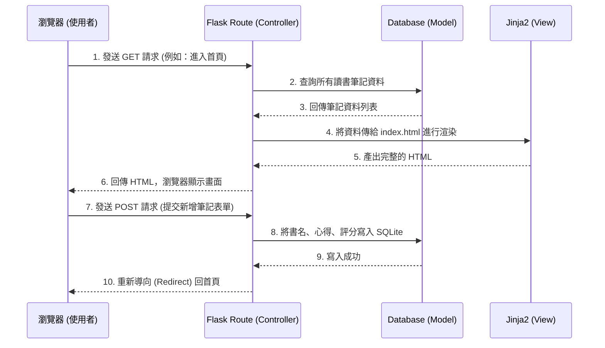

# 讀書筆記本系統 - 架構設計文件 (Architecture Document)

## 1. 技術架構說明
本專案採用 **Flask + Jinja2 + SQLite** 作為核心技術堆疊。這是一個輕量且適合學生建立個人網頁應用的經典組合。我們將不採用前後端分離的架構，而是由後端直接渲染 HTML 頁面返回給瀏覽器。

- **後端框架：Python + Flask**
  - **原因**：Flask 是輕量級的 Web 框架，學習曲線平緩，能快速開發出 MVP（最小可行性產品）。
  - **角色 (Controller)**：負責接收使用者的 HTTP 請求（如新增筆記、搜尋），與資料庫互動後，決定要回傳哪個畫面。
- **模板引擎：Jinja2**
  - **原因**：內建於 Flask，可以直接在 HTML 中嵌入 Python 變數與邏輯（如 `for` 迴圈顯示書單），非常直覺。
  - **角色 (View)**：負責網頁的畫面呈現與排版。
- **資料庫：SQLite**
  - **原因**：不需要額外安裝資料庫伺服器，資料儲存在單一檔案中，非常適合個人筆記本這種輕量級應用。
  - **角色 (Model)**：負責資料的長期儲存，如書名、心得、評分等資訊。

## 2. 專案資料夾結構

本專案將採用以下資料夾結構，以保持程式碼的清晰易讀：

```text
web_app_development2/
│
├── app/                      # 應用程式主資料夾
│   ├── models/               # 資料庫模型 (Model)
│   │   └── database.py       # 處理 SQLite 的連線與資料表操作
│   │
│   ├── routes/               # 路由與邏輯 (Controller)
│   │   └── notes.py          # 處理新增、修改、刪除、搜尋等路由
│   │
│   ├── templates/            # HTML 模板檔案 (View)
│   │   ├── base.html         # 共用模板（包含導覽列、載入 CSS）
│   │   ├── index.html        # 首頁（書單列表、搜尋結果）
│   │   ├── add_note.html     # 新增筆記頁面
│   │   └── edit_note.html    # 編輯筆記頁面
│   │
│   └── static/               # 靜態資源檔案
│       ├── css/
│       │   └── style.css     # 網頁樣式
│       └── images/           # 圖片資源（若有）
│
├── instance/                 # 存放資料庫等不進版控的本機檔案
│   └── database.db           # SQLite 資料庫檔案
│
├── docs/                     # 專案說明文件
│   ├── PRD.md                # 產品需求文件
│   └── ARCHITECTURE.md       # 系統架構文件（本文件）
│
├── app.py                    # 應用程式入口點，負責啟動 Flask
└── requirements.txt          # 專案所需的 Python 套件清單
```

## 3. 元件關係圖

以下是系統運作的資料與控制流程圖，說明從使用者點擊網頁到資料庫存取的過程：



## 4. 關鍵設計決策

1. **不採用前後端分離（No API + SPA）**
   - **原因**：為了在短時間內完成 MVP，不採用 React 或 Vue.js 等前端框架。直接使用 Flask 搭配 Jinja2 渲染 HTML，不僅開發速度快，也能減少架構的複雜度，非常適合目前的個人讀書筆記本需求。
2. **SQLite 作為唯一資料庫**
   - **原因**：目標用戶為學生記錄個人閱讀，資料量小且無高併發需求。SQLite 不需要架設獨立伺服器，且備份只需複製 `.db` 檔案，管理極度方便。
3. **集中管理路由邏輯**
   - **原因**：將所有的路由邏輯統一放在 `app/routes/` 目錄中，並根據功能（如 `notes.py`）進行拆分，這讓未來的擴充（例如加入標籤系統或使用者驗證）時，程式碼不會全部擠在 `app.py` 中。
4. **使用 Base 模板繼承**
   - **原因**：Jinja2 支援模板繼承，我們會建立一個 `base.html` 包含基礎的 HTML 結構、CSS 載入與導覽列，其他頁面只需繼承它即可。這樣不僅減少重複程式碼，未來修改樣式也只需改一個地方。
