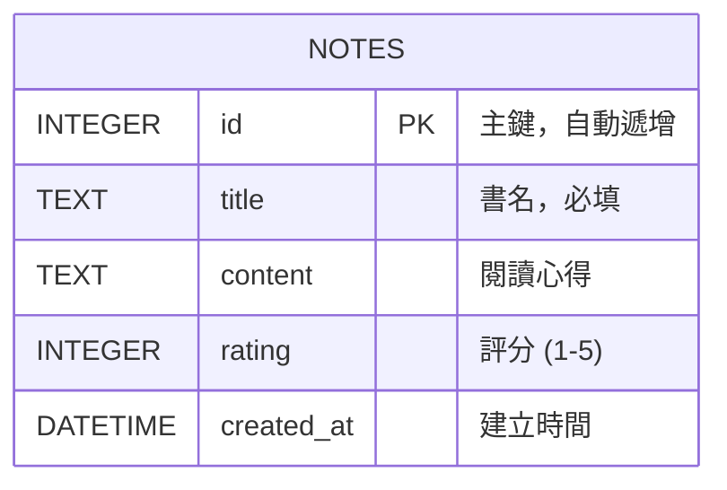

# 讀書筆記本系統 - 資料庫設計 (DB Design)

## 1. ER 圖 (實體關係圖)

## 2. 資料表詳細說明

### NOTES 資料表 (讀書筆記)
儲存使用者的每一筆讀書筆記紀錄。

| 欄位名稱 | 型別 | 說明 | 限制 |
| --- | --- | --- | --- |
| `id` | INTEGER | 筆記的唯一識別碼 | PRIMARY KEY, AUTOINCREMENT |
| `title` | TEXT | 書籍名稱 | NOT NULL |
| `content` | TEXT | 閱讀心得與筆記內容 | |
| `rating` | INTEGER | 對書籍的評分，通常為 1 到 5 星 | |
| `created_at` | DATETIME | 紀錄建立的時間 | DEFAULT CURRENT_TIMESTAMP |

## 3. SQL 建表語法

請參考 `database/schema.sql` 檔案。

## 4. Python Model 程式碼

請參考 `app/models/` 目錄下的 Python 檔案。我們使用內建的 `sqlite3` 模組來進行資料庫操作。
