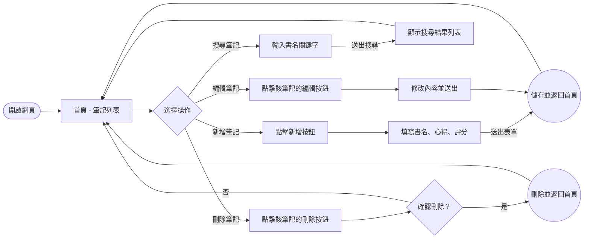
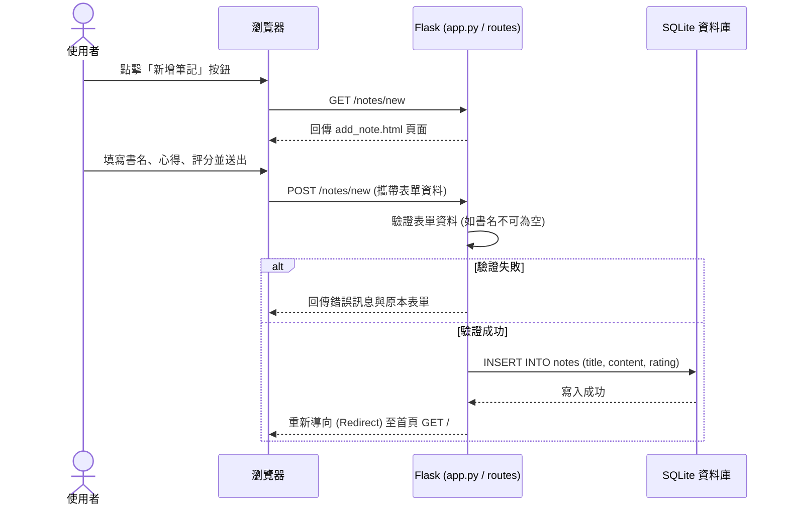

# 讀書筆記本系統 - 流程圖 (Flowchart)

根據 PRD 與系統架構，以下是本系統的使用者流程與系統互動序列圖。

## 1. 使用者流程圖 (User Flow)

展示使用者進入系統後的各種操作路徑：

## 2. 系統序列圖 (Sequence Diagram)

以「新增讀書筆記」為例，展示前端瀏覽器與後端 Flask、SQLite 資料庫的互動過程：

## 3. 功能清單對照表

本系統預計包含的頁面與路由對應：

| 功能名稱 | 對應頁面 (Jinja2) | URL 路徑 | HTTP 方法 | 說明 |
| --- | --- | --- | --- | --- |
| **首頁 / 筆記列表** | `index.html` | `/` | GET | 顯示所有讀書筆記，或根據搜尋條件顯示 |
| **搜尋筆記** | `index.html` | `/` | GET | 透過 query string (如 `?q=關鍵字`) 進行搜尋 |
| **新增筆記頁面** | `add_note.html` | `/notes/new` | GET | 顯示新增表單 |
| **處理新增筆記** | - | `/notes/new` | POST | 接收表單資料並存入資料庫，完成後重導向首頁 |
| **編輯筆記頁面** | `edit_note.html` | `/notes/<id>/edit` | GET | 顯示並帶入該筆記的原始資料 |
| **處理編輯筆記** | - | `/notes/<id>/edit` | POST | 更新資料庫中的筆記內容，完成後重導向首頁 |
| **刪除筆記** | - | `/notes/<id>/delete` | POST | 接收刪除請求並執行刪除，完成後重導向首頁 |

> 備註：刪除操作使用 POST 方法而非 GET，以防止瀏覽器預先載入 (Prefetch) 導致資料意外被刪除的風險。
